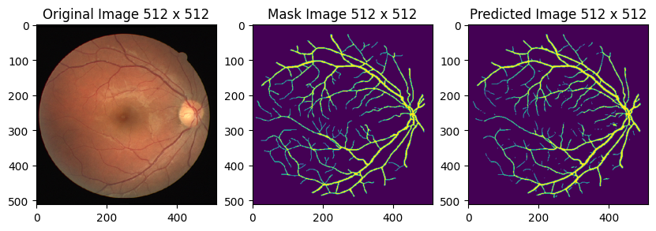
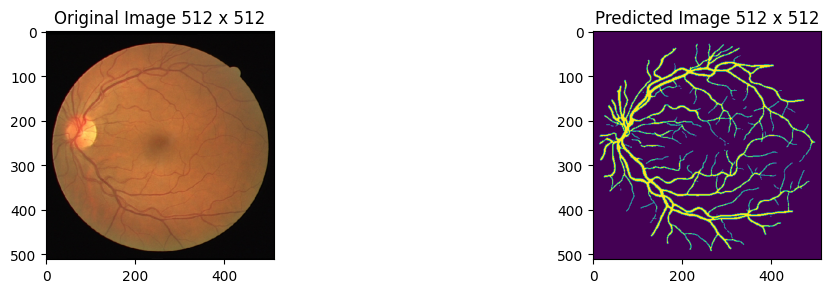
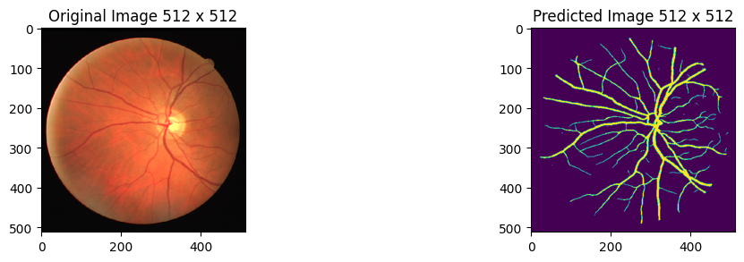

# U-Net Model for Vessel Segmentation

This project implements an advanced multi-branch U-Net architecture for vessel segmentation in medical images, achieving state-of-the-art performance. By integrating VGG19, ResNeXt50, and EfficientNet-B4 backbones with an attention-based fusion mechanism, this model currently ranks **1st place** with a mean Dice score of **0.81966**, surpassing both advanced (0.80102) and basic (0.59445) baselines.

## Project Overview

### Description
The goal of this project is to segment blood vessels in medical images with high accuracy. The model is evaluated using the **mean Dice coefficient**, a metric that measures pixel-wise agreement between predicted segmentations and ground truth masks. The formula is:

$Dice = 2 * |X ∩ Y| / (|X| + |Y|)$


Where:
- `X`: Predicted set of pixels.
- `Y`: Ground truth set of pixels.

The Dice score ranges from 0 to 1, with 1 indicating perfect agreement. The leaderboard score is the average Dice coefficient across all test set images.

### Current Performance
- **Our Model**: **0.81966** (1st place).
- **Advanced Baseline**: 0.80102.
- **Basic Baseline**: 0.59445.

### Evaluation and Submission
The evaluation uses **run-length encoding (RLE)** to reduce submission file size. Instead of listing all segmented pixels, predictions are submitted as pairs of values: a start position and a run length (e.g., "1 3" means pixels 1, 2, 3). The format requires:
- Sorted, positive pairs with no duplicate pixels.
- Pixels numbered top-to-bottom, left-to-right (e.g., 1 is (1,1), 2 is (2,1), etc.).
- Submission file format:
  ```
  img,pixels
  1,1 1 5 1
  2,1 1
  3,1 1
  ```

## Features
- **Multi-branch Architecture**: Combines VGG19, ResNeXt50, and EfficientNet-B4 as encoders.
- **Attention-based Fusion**: Employs an SEBlock and learnable weights to fuse outputs adaptively.
- **Custom Losses**: Uses Dice Loss, Focal Loss, and Cross-Entropy Loss for robust optimization.
- **Two-phase Training**: Initial training with frozen encoders, followed by fine-tuning.
- **Mixed Precision**: Leverages PyTorch AMP for efficiency.

## Model Architecture
- **Encoders**: VGG19-BN, ResNeXt50 (32x4d), EfficientNet-B4.
- **Fusion Layer**: SEBlock and weighted combination of branch outputs.
- **Output**: 2-channel segmentation map (background and vessel).

## Results
Below are examples of original images, ground truth masks, and predicted masks:

  
  


## Requirements
Install dependencies using:
```bash
pip install -r requirements.txt
```

`requirements.txt`:
```
torch>=2.0.0
torchvision>=0.15.0
pillow>=9.0.0
albumentations>=1.3.0
numpy>=1.24.0
pandas>=2.0.0
matplotlib>=3.7.0
```

## Installation
1. Clone the repository:
   ```bash
   git clone https://github.com/your-username/U-Net-Model-for-Vessel-Segmentation.git
   cd U-Net-Model-for-Vessel-Segmentation
   ```
2. Install dependencies:
   ```bash
   pip install -r requirements.txt
   ```

## Usage
1. **Prepare Dataset**: Ensure your data is in a format compatible with PyTorch `DataLoader`.
2. **Train the Model**:
   ```python
   model = Unet().to(device)
   train_loader = DataLoader(train_dataset, batch_size=16, shuffle=True)
   val_loader = DataLoader(val_dataset, batch_size=16)
   train_two_phase(model, train_loader, val_loader, device)
   ```
3. **Fine-tune**:
   ```python
   continue_training(model, train_loader, val_loader, device, num_epochs=40)
   ```
4. **Inference**: Use the trained model to generate segmentation masks.

## Training Strategy
- **Phase 1**: Train center, decoder, and fusion layers with frozen encoders.
- **Phase 2**: Fine-tune all parameters.
- **Continued Training**: Optimize with lower learning rates and mixed precision.

## Submission Preparation
To generate a submission file in RLE format:
1. Run inference on the test set.
2. Convert predictions to RLE using a utility function (not included in the snippet).
3. Save in the required CSV format.

## Future Work
- Enhance with additional backbones (e.g., Vision Transformer).
- Integrate advanced data augmentation.
- Explore ensemble techniques for further improvement.

## License
MIT License - see [LICENSE](LICENSE) for details.

## Acknowledgments
- Built with [PyTorch](https://pytorch.org/) and [torchvision](https://pytorch.org/vision/stable/index.html).
- Inspired by U-Net and multi-branch segmentation research.
```


